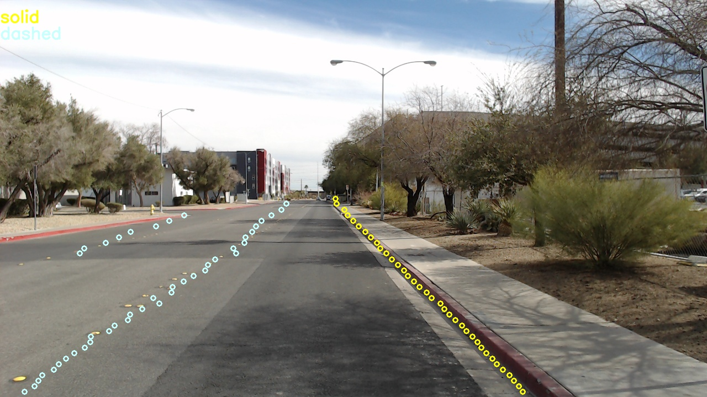

# LVLane
## Introduction
This repository is the official implementation of the paper "[LVLane: Lane Detection and Classification in Challenging Conditions](https://arxiv.org/abs/2307.06853)", accpeted in 2023 IEEE International Conference on Intelligent Trabsportation Systems (ITSC).



## Table of Contents
* [Introduction](#Introduction)
* [Benchmark and model zoo](#Benchmark-and-model-zoo)
* [Installation](#Installation)
* [Getting Started](#Getting-started)
* [Contributing](#Contributing)
* [Licenses](#Licenses)
* [Acknowledgement](#Acknowledgement)

## Benchmark and model zoo
Supported backbones:
- [x] ResNet
- [x] ERFNet
- [x] VGG
- [x] MobileNet

Supported detectors:
- [x] [UFLD](configs/ufld)
- [x] [RESA](configs/resa)


## Installation
This repository is a modified version of [lanedet](https://github.com/Turoad/lanedet.git); so, it you installed that, no need to install this one. Just clone this and use the same conda environment.
<!--
Please refer to [INSTALL.md](INSTALL.md) for installation.
-->

### Clone this repository
```
git clone https://github.com/zillur-av/LVLane.git
```
We call this directory as `$LANEDET_ROOT`

### Create a conda virtual environment and activate it (conda is optional)

```Shell
conda create -n lanedet python=3.8 -y
conda activate lanedet
```

### Install dependencies

```Shell
# Install pytorch firstly, the cudatoolkit version should be same in your system.

conda install pytorch==1.8.0 torchvision==0.9.0 cudatoolkit=10.1 -c pytorch

# Or you can install via pip
pip install torch==1.8.0 torchvision==0.9.0

# Install python packages
python setup.py build develop
```

## Data preparation

### Tusimple
Download [Tusimple](https://github.com/TuSimple/tusimple-benchmark/issues/3). Then extract them to `$DATASETROOT`. Create link to `data` directory.

```Shell
cd $LANEDET_ROOT
mkdir -p data
ln -s $DATASETROOT data/tusimple
```

For Tusimple, you should have structure like this:
```
$DATASETROOT/clips # data folders
$DATASETROOT/lable_data_xxxx.json # label json file
$DATASETROOT/test_label.json # test label json file

```
### LVLane
Download [LVLaneV1](https://drive.google.com/file/d/1lRhne-d87A4b0gLjf6quipDQ4MYvP7ky/view?usp=sharing). Then extract them to `$DATASETROOT` just like TuSimple dataset. This link contains class annotations for TuSimple dataset, so replace the orginal labels ones with the new ones. Lane annotations and class labels of Caltech dataset are also available in TuSimple format. Download the dataset from original site and resize them to 1280x720 to use with this model.

```
$DATASETROOT/clips/0531/
.
.
$DATASETROOT/clips/LVLane_train_sunny/
$DATASETROOT/label_data_xxxx.json
$DATASETROOT/test_label.json 
$DATASETROOT/LVLane_test_sunny.json
$DATASETROOT/LVLane_train_sunny.json

```
If you want to create a dataset in tusimple format, please follow instructions on [tusimple-annotation](https://github.com/zillur-av/tusimple-annotation)
We need to generate segmentation from the json annotation. 
### Generate masks
```Shell
python tools/generate_seg_tusimple.py --root $DATASETROOT --filename 'LVLane_test_sunny'
# this will generate seg_label directory
```
Then you will find new `json` annotations files that have both lane location and class id in `$DATASETROOT/seg_label/list/`. Replace the old annotation files in `$DATASETROOT` by these new files.

## Getting Started
If we want just detection, no lane classification, switch to `detection` branch by running `git checkout detection`.
### Training

For training, run

```Shell
python main.py [configs/path_to_your_config] --gpus [gpu_ids]
```


For example, run
```Shell
python main.py configs/ufld/resnet18_tusimple.py --gpus 0
```
Modifications before you run training script:
* Check image resolution in here https://github.com/zillur-av/LVLane/blob/f89d53d63b45069fdae6689157c7f33caa6c8652/configs/ufld/resnet18_tusimple.py#L56-L61
  If your images have different resolution, try to resize them to 1280x720. Modify the annotations proportionately as well. This will be the best way to handle that situation.
* Modify batch size, number of training samples, epochs in https://github.com/zillur-av/LVLane/blob/f89d53d63b45069fdae6689157c7f33caa6c8652/configs/ufld/resnet18_tusimple.py#L40-L43


### Testing
For testing, run
```Shell
python main.py [configs/path_to_your_config] --test --load_from [path_to_your_model] [gpu_num]
```

For example, run
```Shell
python main.py configs/ufld/resnet18_tusimple.py --test --load_from ufld_tusimple.pth --gpus 0
```

Currently, this code can output the visualization result when testing, just add `--view`.
We will get the visualization result in `work_dirs/xxx/xxx/visualization`.

I am providing a sample weights for quick testing. You can download it from [here](https://drive.google.com/file/d/1YYWE-KiihE2c4BtYHeR2BuzXQkwjk0J3/view?usp=sharing) and put it on `$LANEDET_ROOT`. If you want to test your own images, create the json file and image folders following above instructions. Then edit `val` and `test` in https://github.com/zillur-av/LVLane/blob/943dbd3ac043bcee64c061b2db8e55e802bfc07f/lanedet/datasets/tusimple.py#L21 and in configs file https://github.com/zillur-av/LVLane/blob/943dbd3ac043bcee64c061b2db8e55e802bfc07f/configs/ufld/resnet18_tusimple.py#L120.

For example, run
```Shell
python main.py configs/ufld/resnet18_tusimple.py --test --load_from best-ufld.pth --gpus 0 --view
```

### Inference
See `tools/detect.py` for detailed information.
```
python tools/detect.py --help

usage: detect.py [-h] [--img IMG] [--show] [--savedir SAVEDIR]
                 [--load_from LOAD_FROM]
                 config

positional arguments:
  config                The path of config file

optional arguments:
  -h, --help            show this help message and exit
  --img IMG             The path of the img (img file or img_folder), for
                        example: data/*.png
  --show                Whether to show the image
  --savedir SAVEDIR     The root of save directory
  --load_from LOAD_FROM
                        The path of model
```
To run inference on example images in `./images` and save the visualization images in `vis` folder:
```
python tools/detect.py configs/ufld/resnet18_tusimple.py --img images\
          --load_from best-ufld.pth --savedir ./show
```


## Contributing
We appreciate all contributions to improve LVLane.  Any pull requests or issues are welcomed.

## Licenses
This project is released under the [Apache 2.0 license](LICNESE).


## Acknowledgement
<!--ts-->
* [Turoad/lanedet](https://github.com/Turoad/lanedet)
* [pytorch/vision](https://github.com/pytorch/vision)
* [ZJULearning/resa](https://github.com/ZJULearning/resa)
* [cfzd/Ultra-Fast-Lane-Detection](https://github.com/cfzd/Ultra-Fast-Lane-Detection)
<!--te-->


## Citation
If you use our work or dataset, please cite the following paper:
```
@article{rahman2023lvlane,
  title={LVLane: Deep Learning for Lane Detection and Classification in Challenging Conditions},
  author={Rahman, Zillur and Morris, Brendan Tran},
  journal={2023 IEEE International Conference on Intelligent Trabsportation Systems (ITSC)},
  year={2023}
}

```
